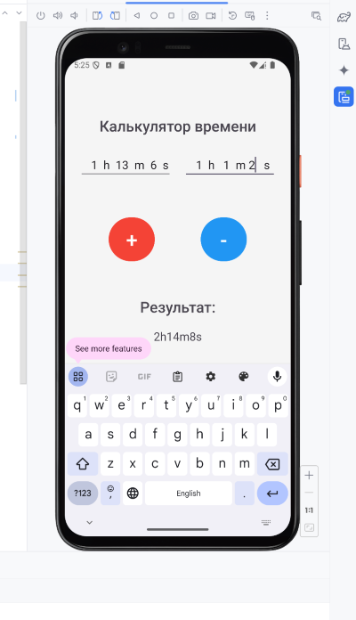
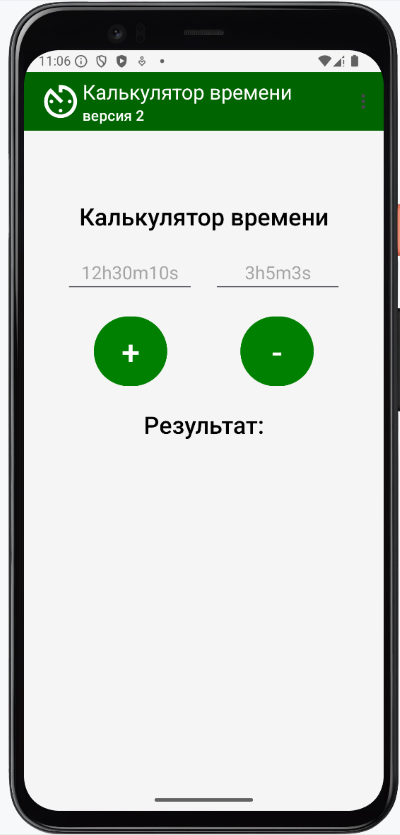
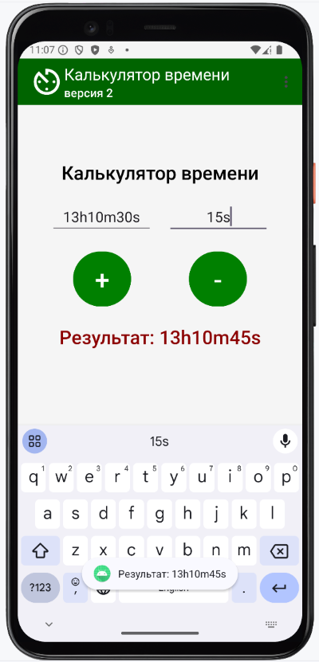
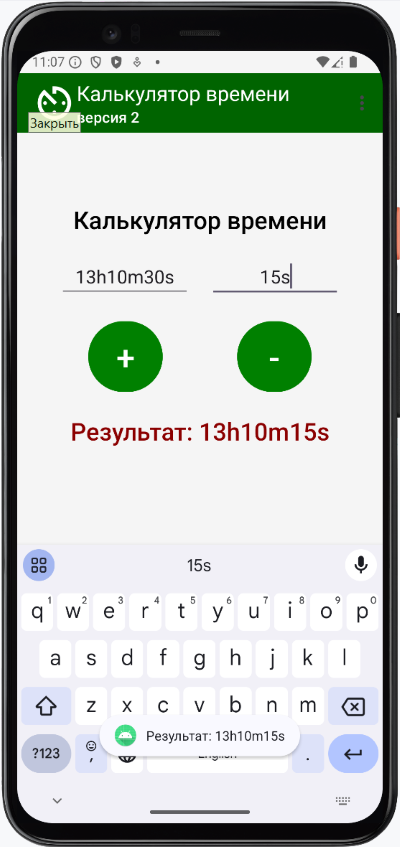
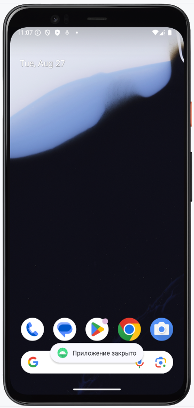

# Домашнее задание по теме "Calculator"

### Ваша задача:

Программа калькулятор времени

1. Поля ввода принимают значения времени в таком виде: 1m 44s – значит одна минута 44 секунды или
   1h23m32s – один час 23 минуты 32 секунды, например.

2. Написать функции сложения и вычитания времени с учетом конвертации (перевода) введенной строки в
   секунды, допустим, и обратной конвертации полученного результата в поле вывода результата в
   формате: 1m23s.

3. Примерный макет экрана с результатом ввода и вывода информации.

**Калькулятор времени**

### Изменения по домашнему заданию

1. заменил `android:text` на `android:hint` для EditText
2. Добавил пропуск пробелов при обработки введенного текста в EditText.

### Скриншоты

Скриншоты здесь

 

# Домашнее задание по теме "Toolbar Menu Toast"

В приложение **«Калькулятор времени»** (смотри домашнее задание прошлого урока):

1. Добавить **Toolbar** с логотипом, заголовком и подзаголовком. Цвет Toolbar: **#006400**

2. Изменить цвет кнопок приложения: **#008000**

3. Добавить **menu** удаления полей ввода и вывода, описать логику работы (аналогично занятию).

4.  Добавить всплывающее сообщение **Toast** с результатом при выполнении функций сложения и вычитания времени, например, **«Результат: 23m45s»**.

5. Добавить всплывающее сообщение при очистке полей ввода и вывода - «Данные очищены», при закрытии приложения – **«Приложение закрыто»**.

6. **\*\*\*** Изменить текст вывода информации на **#08B000** при выводе результата, при очистке и по умолчанию (при запуске) – черный.

### Скриншоты по домашнему заднию

Скриншоты здесь

 